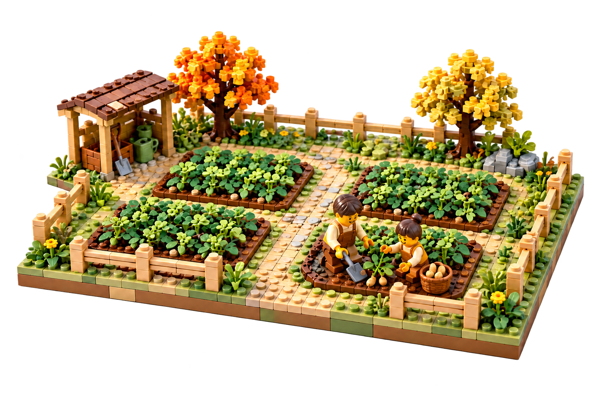

# 微缩积木场景 · Brick Miniature

一个可复用的 Codex Skill：给出文字主题或参考图片，生成具有实体拼搭质感的微缩积木场景。



## 风格特点

- 完整的小场景与底座，统一的人物、植物、建筑和道具比例。
- 可见的积木凸点、接缝与柔和塑料材质，类似拍摄真实收藏模型。
- 三分之四俯视构图、自然暖光、清晰主体与适量景深。
- 主题可以是农园、露营地、咖啡馆、城市街角等；参考农园只用于控制风格。
- 支持白底、透明 PNG、单独背景和真实场景合成。

## 安装

在具备 Skill Installer 的 Codex 中发送：

```text
使用 skill-installer 安装这个技能：
https://github.com/snn106/brick-miniature-skill/tree/main/skills/artifact-template-brick-miniature
```

也可以下载本仓库，将 `skills/artifact-template-brick-miniature` 整个文件夹复制到个人技能目录 `$CODEX_HOME/skills`；未设置 CODEX_HOME 时，默认目录为 `~/.codex/skills`。

务必保留 `assets`、`agents` 与 `artifact-template.json`，不能只复制 SKILL.md。

## 使用示例

```text
$artifact-template-brick-miniature
生成湖边露营的微缩积木场景，有帐篷、小路和篝火，白底，不要人物。
```

```text
$artifact-template-brick-miniature
把我提供的咖啡馆照片变成微缩积木场景，保留吧台和座位布局，透明背景。
```

```text
$artifact-template-brick-miniature
把这个积木模型放在真实森林的空地上，模型清晰，背景虚化。
```

可以补充人物数量、画幅、颜色、视角、需要保留的元素和背景要求。未指定时采用横版 3:2、完整底座、柔和暖光与白底。

## 运行条件与边界

需要运行环境提供可用的图像生成／编辑工具及 imagegen 技能。本仓库提供风格规则与参考图片，不包含图像模型或 API 凭据。

结果由生成模型产生，细节不保证逐像素一致；透明背景输出需要检查实际 alpha 通道。预览在不同软件中可能显示为黑底或白底，这不等于文件本身没有透明通道。

参考图是 AI 生成的微缩场景示意。本项目不是 LEGO 官方项目，也不是可直接照着搭建的零件说明书。

## 文件结构

```text
skills/artifact-template-brick-miniature/
├── SKILL.md
├── artifact-template.json
├── agents/openai.yaml
└── assets/
    ├── reference.png
    └── preview.png
```

[技能正文](skills/artifact-template-brick-miniature/SKILL.md) · [OpenAI 技能文档](https://developers.openai.com/plugins/build/skills)
